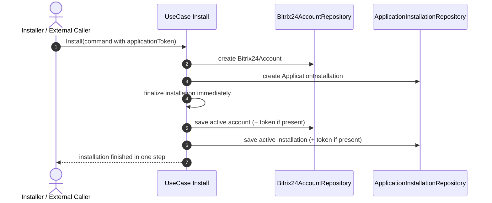
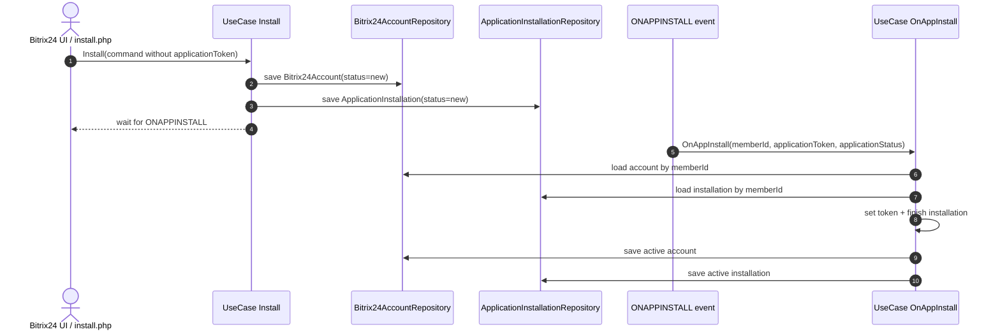

## План обновления документации для разработчика (`gh` CLI, GitHub MCP, Claude Code)

### Summary
Цель: обновить документацию проекта так, чтобы новый разработчик или агент мог без устных пояснений:
- подготовить рабочее окружение для работы с репозиторием, включая `gh` CLI, GitHub MCP и project MCP `bitrix24-dev`;
- понять два поддерживаемых сценария установки приложения в `ApplicationInstallations`;
- получить sequence diagrams и описание use case'ов;
- опереться на unit-тесты, которые фиксируют инварианты доменной модели для одношаговой и двухшаговой установки.

Текущее состояние:
- `README.md` и `AGENTS.md` уже описывают project MCP `bitrix24-dev`.
- В документации пока нет явного требования установить и настроить GitHub MCP.
- В документации пока нет явного требования установить и авторизовать `gh` CLI.
- Нужно отдельно зафиксировать требования для работы через Claude Code.
- В `ApplicationInstallations` нет локального документа с описанием одношаговой и двухшаговой установки.
- Текущий `Install` handler завершает установку сразу даже без `application_token`, поэтому поведение для двухшагового сценария нужно явно изменить и зафиксировать в документации и тестах.

### Important Changes / Interfaces
1. Обновить основной онбординг в `README.md`
- Добавить раздел `Developer Setup` или `AI/CLI Tooling`.
- Явно перечислить обязательные инструменты:
  - `gh` CLI
  - GitHub MCP server
  - `bitrix24-dev` MCP server
  - Docker / Make
- Добавить короткий smoke-check перед началом работы.

2. Добавить требования для Claude Code
- Вынести отдельный подраздел `Claude Code`.
- Зафиксировать, что для полноценной работы клиент должен видеть:
  - `bitrix24-dev`
  - GitHub MCP
- Отдельно указать, что без установленного и авторизованного `gh` CLI GitHub-сценарии будут неполными или недоступными.

3. Синхронизировать `AGENTS.md`
- Расширить требования к окружению агентов.
- Добавить ожидание наличия GitHub MCP.
- Добавить требование по `gh` CLI там, где агент работает с GitHub-задачами.
- Сохранить правило про проверку `.mcp.json` и перезапуск клиента после его изменения.

4. Расширить справочную документацию в `docs/tech-stack.md`
- Добавить раздел про developer tooling.
- Кратко описать назначение:
  - `gh` CLI для работы с GitHub из терминала
  - GitHub MCP для работы агента с GitHub-контекстом
  - `bitrix24-dev` MCP для доступа к Bitrix24-документации

5. Уточнить контракт `ApplicationInstallations\UseCase\Install`
- Явно разделить два сценария:
  - одношаговая установка: `Install` завершает установку сразу, только если `application_token` пришёл в команду;
  - двухшаговая установка: `Install` только создаёт агрегаты в статусе `new`, а завершение делает `OnAppInstall`.

6. Уточнить контракт `ApplicationInstallations\UseCase\OnAppInstall`
- Сделать `OnAppInstall` use case ответственным за завершение установки в двухшаговом сценарии.
- После получения `application_token` use case должен переводить агрегаты из `new` в `active` и сохранять токен.
- Для двухшагового сценария `OnAppInstall` должен искать master account в состоянии `new`, а не `active`, потому что до прихода события установка ещё не завершена.
- Завершение двухшаговой установки обязательно должно происходить через вызов use case `OnAppInstall`; обход этого use case прямыми вызовами методов агрегатов вне сценария запрещён.
- Если событие `ONAPPINSTALL` приходит повторно для уже завершённой установки, use case ничего не делает, пишет `warning` в лог и завершает обработку как `no-op`.
- Если событие `ONAPPINSTALL` не приходит для pending-инсталляции, это не решается в рамках текущей задачи кодом use case; нужно создать GitHub issue на проектирование фонового сборщика битых инсталляций.

7. Добавить локальную документацию по use case'ам установки
- Создать файл `src/ApplicationInstallations/Docs/application-installations.md`.
- Описать там оба user story.
- Дать ссылки на внешний контракт:
  - `https://github.com/bitrix24/b24phpsdk/blob/v3/src/Application/Contracts/ApplicationInstallations/Docs/ApplicationInstallations.md`
  - `https://apidocs.bitrix24.com/api-reference/common/events/on-app-install.html`

8. Добавить sequence diagrams
- В `src/ApplicationInstallations/Docs/application-installations.md` положить две sequence diagram в формате Mermaid:
  - `US1: Одношаговая установка`
  - `US2: Двухшаговая установка через ONAPPINSTALL`

9. Добавить unit-тесты на инварианты use case'ов
- Написать unit-тесты для `Install` и `OnAppInstall`, которые работают через in-memory repositories.
- Для `US2` проверять состояние после каждого шага: после `Install` и после `OnAppInstall`.

### Implementation Plan
1. Обновить `README.md` как главный документ быстрого старта:
- добавить обязательные prerequisites для developer tooling;
- описать установку и базовую проверку `gh`;
- описать обязательные MCP для Codex / Claude Code;
- добавить checklist перед началом работы.

2. Обновить `AGENTS.md`:
- дополнить список ожидаемых MCP-серверов;
- зафиксировать, что при работе с GitHub-задачами агент должен иметь доступ к GitHub MCP и `gh` CLI;
- оставить существующие проверки `.mcp.json` и client restart после изменений.

3. Обновить `docs/tech-stack.md`:
- добавить отдельный раздел `Developer Tooling`;
- перечислить `gh`, GitHub MCP, `bitrix24-dev`;
- кратко пояснить, для каких задач используется каждый инструмент.

4. Добавить единый checklist готовности окружения:
- `.mcp.json` существует и актуален;
- в клиенте доступен `bitrix24-dev`;
- в клиенте доступен GitHub MCP;
- `gh --version` отрабатывает;
- `gh auth status` показывает успешную авторизацию;
- локальные команды проекта запускаются.

5. Изменить доменное поведение `ApplicationInstallations\UseCase\Install`:
- если `applicationToken` передан, завершать установку сразу;
- если `applicationToken` не передан, создавать `Bitrix24Account` и `ApplicationInstallation` в статусе `new` без финализации установки;
- вариант принудительного завершения установки без `applicationToken` в план не входит и не реализуется.
- если по тому же `memberId` уже существует pending-инсталляция в статусе `new`, повторный вызов `Install` должен переводить старые записи `Bitrix24Account` и `ApplicationInstallation` в статус `deleted`, а затем создавать новую пару записей.

6. Изменить доменное поведение `ApplicationInstallations\UseCase\OnAppInstall`:
- use case должен находить агрегаты, созданные на первом шаге;
- master account должен искаться среди записей в статусе `new`, чтобы pending-установка могла быть завершена корректно;
- сохранять `applicationToken` в `Bitrix24Account` и `ApplicationInstallation`;
- переводить оба агрегата в финальное состояние установки;
- обновлять `applicationStatus` у `ApplicationInstallation`.
- Этот use case является обязательной точкой входа для завершения `US2`; никакой альтернативный путь финализации установки не допускается.
- при повторном событии для уже завершённой установки use case должен отработать как `no-op` и записать `warning` в лог;
- отсутствие события для зависшей pending-инсталляции не закрывается в этом change set, а выносится в отдельное GitHub-обсуждение.

7. Инициировать обсуждение по битым инсталляциям в GitHub
- Создать отдельный GitHub issue на проектирование фонового сборщика битых инсталляций, для которых `Install` уже создал записи в статусе `new`, но `ONAPPINSTALL` не был доставлен.
- В issue зафиксировать, что нужно обсудить и выбрать стратегию восстановления.
- Варианты для обсуждения:
  - периодический worker, который ищет `new`-инсталляции старше заданного TTL и переводит их в специальный failed/broken сценарий;
  - периодический worker, который ищет `new`-инсталляции старше TTL и только создаёт alert/issue/notification без автоматической смены статуса;
  - reconciliation job, который пытается повторно сверить состояние установки через доступные внешние признаки и только потом принимает решение;
  - ручной operational flow: список зависших инсталляций + консольная команда/админский action для разбора.

7. Добавить локальную документацию по установке приложения:
- создать `src/ApplicationInstallations/Docs/application-installations.md`;
- описать `US1` и `US2`;
- добавить ссылки на внешний контракт `b24phpsdk` и на документацию события `ONAPPINSTALL`;
- положить в документ две Mermaid sequence diagram.

8. Подготовить unit-тестовую инфраструктуру:
- добавить in-memory репозиторий для `ApplicationInstallationRepositoryInterface`;
- добавить in-memory репозиторий для `Bitrix24AccountRepositoryInterface`;
- при необходимости добавить test double для `Flusher`, чтобы unit-тесты проверяли только состояние агрегатов.

9. Написать unit-тесты на user stories и инварианты:
- отдельный тест на `US1` с `applicationToken`;
- отдельный сценарный тест на `US2`, где последовательно вызываются `Install`, затем `OnAppInstall`, и проверяется состояние после каждого шага.

### ApplicationInstallations User Stories
#### US1. Одношаговая установка
Сценарий:
- вызывается `Install`;
- на событие `ONAPPINSTALL` мы не подписываемся;
- установка финализируется сразу через `Install`, потому что `application_token` уже пришёл в команду;
- это используется в случае, когда приложение ставится без UI и `application_token` прилетает сразу.

Ожидаемое поведение:
- при наличии `applicationToken` use case завершает установку сразу и сохраняет токен;
- `Bitrix24Account` после `Install` находится в `active`;
- `ApplicationInstallation` после `Install` находится в `active`.

#### US2. Двухшаговая установка
Сценарий:
- сначала вызывается `Install`;
- use case создаёт агрегаты без токена в статусе `new`;
- приложение подписывается на событие `ONAPPINSTALL`;
- позже на endpoint приходит событие с `application_token`;
- вызывается `OnAppInstall`, который завершает установку.

Ожидаемое поведение:
- после первого шага `Bitrix24Account` находится в `new`;
- после первого шага `ApplicationInstallation` находится в `new`;
- после первого шага токен отсутствует;
- `OnAppInstall` ищет master account именно в статусе `new`;
- завершение установки выполняется обязательным вызовом `OnAppInstall`;
- если во второй вкладке запускают новую установку до прихода `ONAPPINSTALL` по первой, второй вызов `Install` переводит старые pending-записи в `deleted` и создаёт новые записи для новой попытки установки;
- если `ONAPPINSTALL` не пришёл, инсталляция остаётся pending; дальнейшая стратегия выносится в отдельный GitHub issue про фоновый сборщик битых инсталляций;
- если `ONAPPINSTALL` пришёл повторно после успешного завершения установки, `OnAppInstall` ничего не делает и пишет `warning` в лог;
- после вызова `OnAppInstall` токен сохранён;
- после вызова `OnAppInstall` оба агрегата находятся в `active`.

### Documentation Deliverable
- Новый локальный документ: `src/ApplicationInstallations/Docs/application-installations.md`.
- Содержимое документа:
  - назначение `Install` и `OnAppInstall`;
  - описание `US1` и `US2`;
  - обе sequence diagram;
  - явное различие между одношаговой и двухшаговой установкой;
  - явное правило, что для `US2` завершение установки всегда выполняется через use case `OnAppInstall`;
  - правило реинсталляции: если pending-установка в статусе `new` уже существует и пользователь запускает новую установку, старые записи переводятся в `deleted`, после чего создаются новые;
  - правило обработки повторного `ONAPPINSTALL`: `warning + no-op`;
  - ссылка на отдельный GitHub issue по проектированию фонового сборщика битых инсталляций;
  - ссылка на контракт в `b24phpsdk`:
    `https://github.com/bitrix24/b24phpsdk/blob/v3/src/Application/Contracts/ApplicationInstallations/Docs/ApplicationInstallations.md`;
  - ссылка на событие `ONAPPINSTALL`:
    `https://apidocs.bitrix24.com/api-reference/common/events/on-app-install.html`.

### Unit Tests and Invariants
1. Базовые сценарии `Install`
- `US1: Install with applicationToken`
- вызвать `Install`;
- проверить в in-memory repo, что `Bitrix24Account` сохранён в статусе `active`;
- проверить в in-memory repo, что `ApplicationInstallation` сохранён в статусе `active`;
- проверить, что токен сохранён в обоих агрегатах.
- `US2: Install without token`
- вызвать `Install`;
- сразу после вызова проверить, что `Bitrix24Account` в статусе `new`;
- сразу после вызова проверить, что `ApplicationInstallation` в статусе `new`;
- проверить, что токен не сохранён.

2. Базовые сценарии `OnAppInstall`
- `US2: OnAppInstall finalizes pending installation`
- после предыдущего шага вызвать `OnAppInstall`;
- проверить, что use case находит master account в статусе `new`, а не ожидает `active`;
- проверить, что финализация сценария происходит именно через вызов `OnAppInstall`;
- проверить, что `Bitrix24Account` перешёл в `active`;
- проверить, что `ApplicationInstallation` перешёл в `active`;
- проверить, что токен сохранён;
- проверить, что `applicationStatus` у `ApplicationInstallation` обновился значением из события.

3. Corner cases `Install`
- `reinstall while previous installation is still new`
- выполнить первый `Install` без токена и убедиться, что созданы записи в статусе `new`;
- выполнить второй `Install` без токена с тем же `memberId`;
- проверить, что первая пара записей `Bitrix24Account` и `ApplicationInstallation` переведена в `deleted`;
- проверить, что создана новая пара записей;
- проверить, что новая пара записей находится в статусе `new`.
- `reinstall while previous installation is already active`
- подготовить завершённую установку по тому же `memberId`;
- выполнить новый `Install`;
- проверить, что предыдущие записи переведены в `deleted`;
- проверить, что создана новая пара записей;
- проверить, что статус новой пары зависит от наличия `applicationToken` в новом вызове.
- `invalid install payload`
- покрыть unit-тестами `Install\Command` критичные невалидные комбинации входных данных, которые влияют на оба сценария установки;
- отдельно проверить пустой `memberId`, невалидный `bitrix24UserId`, невалидный `applicationVersion`, пустой `applicationToken`, если он передан.

4. Corner cases `OnAppInstall`
- `duplicate ONAPPINSTALL event`
- после успешного завершения `US2` повторно вызвать `OnAppInstall` с тем же событием;
- проверить, что состояние агрегатов не меняется;
- проверить, что use case не падает;
- проверить, что в лог пишется `warning`;
- проверить, что обработка повторного события выполняется как `no-op`.
- `ONAPPINSTALL for missing pending installation`
- вызвать `OnAppInstall`, когда pending installation по `memberId` отсутствует;
- проверить ожидаемое доменное поведение use case: либо контролируемое исключение, либо `warning + no-op`, в зависимости от финального решения по контракту;
- это поведение должно быть явно зафиксировано в документации и тестах, без неявной логики.
- `ONAPPINSTALL when account is not in status new`
- подготовить данные, в которых installation найдена, но master account не находится в `new`;
- проверить, что use case не делает частичного обновления состояния;
- проверить согласованное поведение: controlled exception или `warning + no-op`, в зависимости от финального контракта.
- `ONAPPINSTALL with token mismatch / repeated different token`
- после завершения установки вызвать `OnAppInstall` с другим `applicationToken`;
- проверить, что состояние агрегатов не переписывается бесконтрольно;
- проверить, что use case пишет `warning` и не нарушает инварианты.

5. Lifecycle cases вне синхронных unit-тестов
- `missing ONAPPINSTALL event`
- отдельным unit-тестом не покрывается, потому что это не поведение синхронного use case, а вопрос lifecycle management;
- вместо этого в deliverables входит создание GitHub issue на проектирование фонового сборщика битых инсталляций и обсуждение вариантов восстановления.

6. Тестовые артефакты
- unit-тесты разместить рядом с use case'ами в `tests/Unit/ApplicationInstallations/UseCase/...`;
- in-memory repositories разместить в `tests/Helpers/...` по аналогии с существующими test helpers;
- добавить test double для logger, чтобы явно проверять `warning` в no-op сценариях;
- если потребуется, добавить отдельный сценарный unit-тест, покрывающий полный поток `Install -> OnAppInstall`.

### Recommended Wording
- `Для полноценной работы с репозиторием в Claude Code, Codex и других AI-клиентах требуется установить и настроить GitHub MCP server и gh CLI.`
- `Помимо project MCP bitrix24-dev, клиент должен видеть GitHub MCP.`
- `После изменения .mcp.json необходимо перезапустить клиент и повторно проверить доступность MCP серверов.`
- `Если gh CLI не установлен или не авторизован, GitHub-сценарии разработки и агентной работы будут ограничены.`

### Ownership of Documentation
- `README.md` отвечает за быстрый старт и обязательные шаги онбординга.
- `AGENTS.md` отвечает за требования к агентам и MCP-проверки.
- `docs/tech-stack.md` отвечает за справочный контекст и описание используемых инструментов.

### Test Cases and Scenarios
1. Новый разработчик открывает `README.md` и без дополнительных пояснений:
- устанавливает `gh`;
- проходит `gh auth login`;
- проверяет `gh auth status`;
- проверяет наличие `bitrix24-dev` и GitHub MCP в клиенте;
- запускает базовые команды проекта.

2. Разработчик в Claude Code:
- видит в документации явное требование по GitHub MCP;
- понимает, что одного project MCP недостаточно;
- знает, что после обновления `.mcp.json` нужен restart клиента.

3. Агентная работа:
- `AGENTS.md` не расходится с `README.md`;
- требования к MCP и `gh` CLI описаны одинаково и без противоречий.

4. Документация `ApplicationInstallations`:
- в репозитории появляется `src/ApplicationInstallations/Docs/application-installations.md`;
- в нём описаны `US1` и `US2`;
- обе диаграммы читаемы и отражают фактическое поведение use case'ов;
- документ ссылается на контракт из `b24phpsdk` и на `ONAPPINSTALL` документацию.

5. Unit-тесты по user story:
- `US1` проверяет немедленную финализацию установки;
- `US2` проверяет промежуточное состояние после `Install` и финальное состояние после `OnAppInstall`;
- тесты работают без Doctrine и без БД, только через in-memory repositories.

### Definition of Done
План считается реализованным, когда:
- новый разработчик может с нуля открыть `README.md`, установить `gh`, подключить GitHub MCP, проверить `bitrix24-dev` и GitHub MCP, после чего начать работу с проектом без дополнительных устных инструкций;
- в репозитории есть `src/ApplicationInstallations/Docs/application-installations.md` с описанием `US1` и `US2`, двумя sequence diagram и ссылками на внешний контракт;
- `Install` и `OnAppInstall` поддерживают одношаговую и двухшаговую установку как отдельные сценарии;
- unit-тесты фиксируют инварианты состояний агрегатов для обоих сценариев, включая промежуточное состояние `US2` после первого шага.
