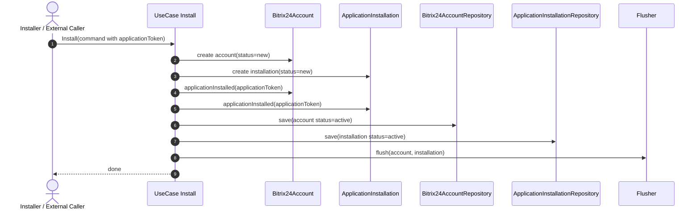
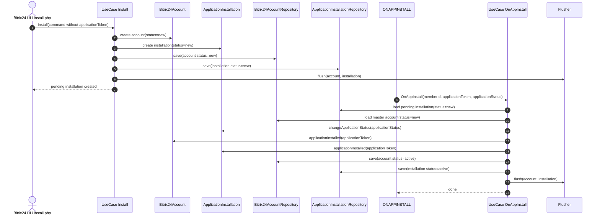
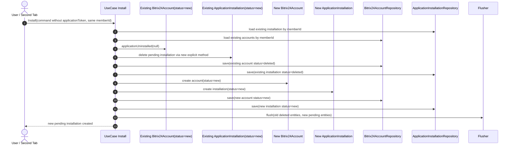

## План исправления install-flow и статусов в `ApplicationInstallations`

### Summary
Issue `#90` описывает баг в `src/ApplicationInstallations/UseCase/Install/Handler.php`: сейчас handler всегда завершает установку сразу, даже если `applicationToken === null`.

Из-за этого ломается двухшаговый install-flow:
- первый шаг UI-установки без `application_token` преждевременно переводит `Bitrix24Account` и `ApplicationInstallation` в `active`;
- finish-события диспатчатся слишком рано;
- `ONAPPINSTALL` перестаёт быть реальным finish-step.

Целевой контракт после исправления:
- `US1`: если `applicationToken` пришёл сразу, `Install` завершает установку в один шаг;
- `US2`: если `applicationToken` не пришёл, `Install` создаёт pending-сущности в статусе `new`, а finish-step выполняет `OnAppInstall`.

### Scope
В рамках этого change set нужно:
- исправить `Install\Handler`;
- исправить `OnAppInstall\Handler`;
- актуализировать unit tests;
- обновить документацию в `src/ApplicationInstallations/Docs`;
- добавить sequence diagrams;
- зафиксировать отдельный follow-up issue для битых pending-инсталляций.

### Target Contract
1. `Install` with token
- Если `Install\Command::$applicationToken !== null`, handler:
  - создаёт `Bitrix24Account` в `new`;
  - создаёт `ApplicationInstallation` в `new`;
  - вызывает `Bitrix24Account::applicationInstalled($applicationToken)`;
  - вызывает `ApplicationInstallation::applicationInstalled($applicationToken)`;
  - сохраняет обе сущности;
  - вызывает `flush`.
- Результат:
  - обе сущности в `active`;
  - токен сохранён;
  - finish-events диспатчатся на этом шаге.

2. `Install` without token
- Если `Install\Command::$applicationToken === null`, handler:
  - создаёт `Bitrix24Account` в `new`;
  - создаёт `ApplicationInstallation` в `new`;
  - сохраняет обе сущности;
  - вызывает `flush`;
  - не вызывает `applicationInstalled(...)`.
- Результат:
  - обе сущности остаются в `new`;
  - токен не сохранён;
  - finish-events не диспатчатся.

3. `OnAppInstall` as canonical finish-step
- Для двухшаговой установки finish-step выполняется только через `src/ApplicationInstallations/UseCase/OnAppInstall/Handler.php`.
- Никакой альтернативный finish-flow через другие use case или прямые вызовы методов агрегатов вне `OnAppInstall` не допускается.

4. Exact `OnAppInstall` finish-flow
- `OnAppInstall\Handler` работает по жёсткому алгоритму:
  - найти pending `ApplicationInstallation` по `memberId` в статусе `new`;
  - найти master `Bitrix24Account` по `memberId` только в статусе `Bitrix24AccountStatus::new`;
  - вызвать `ApplicationInstallation::changeApplicationStatus($applicationStatus)`;
  - вызвать `Bitrix24Account::applicationInstalled($applicationToken)`;
  - вызвать `ApplicationInstallation::applicationInstalled($applicationToken)`;
  - сохранить обе сущности;
  - вызвать `flush`.

5. Exact account lookup rule in `OnAppInstall`
- В `src/ApplicationInstallations/UseCase/OnAppInstall/Handler.php` выборка аккаунта должна идти только по `Bitrix24AccountStatus::new`.
- Выборка по `active` для основного finish-path запрещена.
- Fallback на другие статусы для finish-path запрещён.

### Explicit Behaviour for Corner Cases
1. Duplicate `ONAPPINSTALL`
- Если pending installation в статусе `new` не найдена, но по `memberId` уже существует завершённая `active` installation и `active` master account с тем же `applicationToken`, handler:
  - ничего не меняет;
  - пишет `warning` в лог;
  - завершает обработку как `no-op`.

2. Missing pending installation
- Если pending installation в статусе `new` не найдена и сценарий duplicate-event не подтверждается, `OnAppInstall` завершает обработку с контролируемым исключением.
- Для этого сценария source of truth:
  - `ApplicationInstallationNotFoundException`, если installation не найдена;
  - `Bitrix24AccountNotFoundException`, если installation найдена, а master account в статусе `new` не найден.

3. Token mismatch on repeated event
- Если `ONAPPINSTALL` пришёл для уже завершённой установки, но `applicationToken` отличается от уже сохранённого токена:
  - handler ничего не меняет;
  - пишет `warning` в лог;
  - завершает обработку с контролируемым исключением.

4. Reinstall while previous installation is still `new`
- Если по тому же `memberId` уже есть pending installation в статусе `new`, второй вызов `Install` должен:
  - перевести старый `Bitrix24Account` в `deleted`;
  - перевести старую `ApplicationInstallation` в `deleted`;
  - создать новую пару сущностей.
- Для `ApplicationInstallation` нужно добавить явный доменный переход для удаления pending-installation из статуса `new`.
- Использовать для этого `applicationUninstalled()` нельзя, потому что сейчас он разрешён только из `active|blocked`.

5. Reinstall while previous installation is already `active`
- Поведение остаётся совместимым с текущим reinstall-flow:
  - старые сущности переводятся в `deleted`;
  - создаётся новая пара сущностей;
  - статус новой пары зависит от наличия `applicationToken` в новом вызове.

6. Missing `ONAPPINSTALL` event
- Pending installation может зависнуть в `new`.
- Это не лечится в рамках синхронного use case.
- В рамках задачи создаётся отдельный GitHub issue на проектирование фонового сборщика битых pending-инсталляций.

### Implementation Plan
1. Исправить `src/ApplicationInstallations/UseCase/Install/Handler.php`
- ветка с токеном: оставить one-step finish;
- ветка без токена: не вызывать `applicationInstalled(...)`;
- сохранять `Bitrix24Account` и `ApplicationInstallation` в `new`;
- не диспатчить finish-events на первом шаге без токена.

2. Исправить `src/ApplicationInstallations/UseCase/OnAppInstall/Handler.php`
- сделать `OnAppInstall` единственной точкой finish-step для `US2`;
- пересмотреть выборку аккаунта:
  - finish-path ищет master account только в `Bitrix24AccountStatus::new`;
  - duplicate-event path отдельно проверяет already finished `active` records;
- реализовать exact finish-flow в фиксированном порядке:
  - `changeApplicationStatus(...)`;
  - `Bitrix24Account::applicationInstalled($token)`;
  - `ApplicationInstallation::applicationInstalled($token)`;
  - `save`;
  - `flush`.

3. Добавить явный доменный переход для удаления pending installation
- В `ApplicationInstallation` нужно добавить explicit method для перевода сущности из `new` в `deleted` при re-install.
- Название и API метода должны прямо отражать назначение:
  - удаление незавершённой installation;
  - без требования `applicationToken`.
- Этот переход должен использоваться в `Install\Handler` при re-install поверх `new`.

4. Актуализировать unit tests
- Обновить существующие unit tests `Install`, `OnAppInstall`, `Command` и test helpers.
- Unit tests должны покрывать:
  - `US1`;
  - `US2`;
  - corner cases для `Install`;
  - corner cases для `OnAppInstall`.
- Unit tests являются основным способом фиксации нового контракта.

5. Обновить документацию
- В `src/ApplicationInstallations/Docs` добавить:
  - описание `US1`;
  - описание `US2`;
  - corner cases;
  - sequence diagrams;
  - ссылки на внешний контракт:
    - `https://github.com/bitrix24/b24phpsdk/blob/v3/src/Application/Contracts/ApplicationInstallations/Docs/ApplicationInstallations.md`
    - `https://apidocs.bitrix24.com/api-reference/common/events/on-app-install.html`

6. Создать follow-up GitHub issue
- Отдельно создать issue на проектирование фонового сборщика битых pending-инсталляций.
- В issue предложить варианты:
  - worker с TTL и переводом зависших `new`-installations в broken/failed сценарий;
  - worker с TTL и alert-only поведением;
  - reconciliation job;
  - ручной operational flow.

### Sequence Diagrams For Review
#### Diagram 1. US1 One-Step Install

#### Diagram 2. US2 Two-Step Install Via ONAPPINSTALL

#### Diagram 3. Reinstall While Previous Installation Is Still New

### Unit Tests and Invariants
1. Base scenarios `Install`
- `US1: Install with applicationToken`
  - после `handle()` account и installation находятся в `active`;
  - токен сохранён;
  - finish-events появились.
- `US2: Install without token`
  - после `handle()` account и installation находятся в `new`;
  - токен не сохранён;
  - finish-events не появились.

2. Base scenarios `OnAppInstall`
- `US2: OnAppInstall finalizes pending installation`
  - handler ищет installation по `memberId` в `new`;
  - handler ищет master account по `memberId` только в `new`;
  - выполняется exact finish-flow;
  - после `handle()` обе сущности в `active`;
  - токен сохранён;
  - `applicationStatus` обновлён.

3. Corner cases `Install`
- `reinstall while previous installation is still new`
  - старая пара переводится в `deleted`;
  - новая пара создаётся в `new`.
- `reinstall while previous installation is already active`
  - старая активная пара переводится в `deleted`;
  - новая пара создаётся корректно.
- `invalid install payload`
  - покрыть невалидные комбинации для `Install\Command`.

4. Corner cases `OnAppInstall`
- `duplicate ONAPPINSTALL event with same token`
  - `warning + no-op`.
- `ONAPPINSTALL for missing pending installation`
  - controlled exception.
- `ONAPPINSTALL when account is not in status new`
  - controlled exception;
  - partial update state отсутствует.
- `ONAPPINSTALL with different token for already finished installation`
  - `warning`;
  - controlled exception;
  - state does not change.

5. Test infrastructure
- использовать in-memory repositories для `ApplicationInstallationRepositoryInterface` и `Bitrix24AccountRepositoryInterface`;
- добавить logger test double для проверки `warning`;
- при необходимости добавить flusher test double.

### Files to Touch
- `src/ApplicationInstallations/UseCase/Install/Handler.php`
- `src/ApplicationInstallations/UseCase/OnAppInstall/Handler.php`
- `src/ApplicationInstallations/Entity/ApplicationInstallation.php`
- `tests/Unit/ApplicationInstallations/UseCase/Install/...`
- `tests/Unit/ApplicationInstallations/UseCase/OnAppInstall/...`
- `tests/Helpers/...`
- `src/ApplicationInstallations/Docs/application-installations.md`

### Definition of Done
Исправление считается завершённым, когда:
- `Install` с токеном завершает установку в один шаг;
- `Install` без токена создаёт pending-сущности в `new`;
- `OnAppInstall` является единственным finish-step для двухшаговой установки;
- выборка master account в finish-path идёт только по `Bitrix24AccountStatus::new`;
- duplicate `ONAPPINSTALL` с тем же токеном обрабатывается как `warning + no-op`;
- missing pending installation приводит к контролируемой ошибке;
- re-install поверх pending `new` переводит старые записи в `deleted` и создаёт новые;
- unit tests покрывают обе user story и corner cases;
- документация в `src/ApplicationInstallations/Docs` обновлена и содержит sequence diagrams.
