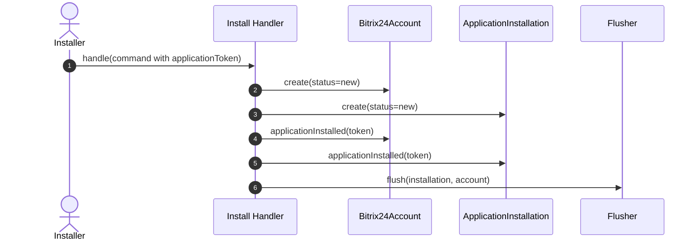
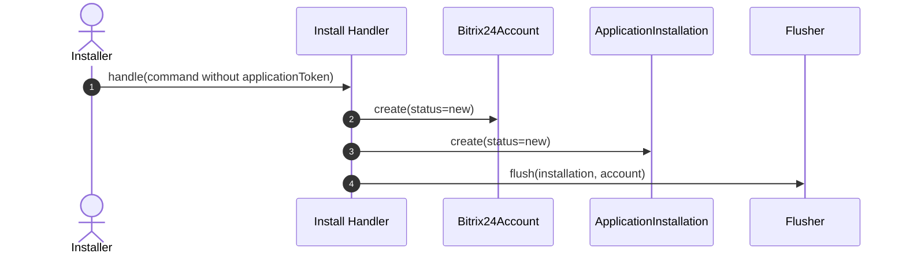
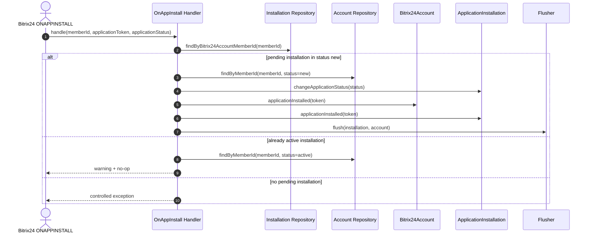
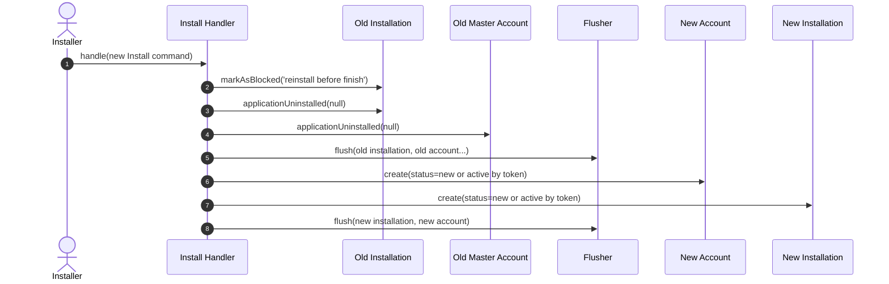

# ApplicationInstallations Install Flow

## Overview

`ApplicationInstallations` stores the installation state for a Bitrix24 portal and coordinates it with the master `Bitrix24Account`.

The install flow is intentionally split into two contracts:

- `US1`: one-step install when the initial `Install` command already contains `applicationToken`
- `US2`: two-step install when `Install` starts the flow in `new`, and `OnAppInstall` performs the canonical finish-step

External references:

- SDK contract: https://github.com/bitrix24/b24phpsdk/blob/v3/src/Application/Contracts/ApplicationInstallations/Docs/ApplicationInstallations.md
- Bitrix24 `ONAPPINSTALL`: https://apidocs.bitrix24.com/api-reference/common/events/on-app-install.html
- Bitrix24 install finish behavior: https://apidocs.bitrix24.ru/api-reference/app-installation/installation-finish.html

## US1: Install With Token

If `Install\Command::$applicationToken !== null`, `src/ApplicationInstallations/UseCase/Install/Handler.php` finishes the installation in one step:

1. Create master `Bitrix24Account` in `new`
2. Create `ApplicationInstallation` in `new`
3. Call `Bitrix24Account::applicationInstalled($applicationToken)`
4. Call `ApplicationInstallation::applicationInstalled($applicationToken)`
5. Persist both aggregates and flush once

Result:

- both aggregates become `active`
- application token is stored immediately
- finish events are emitted on `Install`

## US2: Install Without Token

If `Install\Command::$applicationToken === null`, `Install` only starts the installation:

1. Create master `Bitrix24Account` in `new`
2. Create `ApplicationInstallation` in `new`
3. Persist both aggregates and flush once
4. Do not call `applicationInstalled(...)`

Result:

- both aggregates stay in `new`
- token is still unknown
- finish events are not emitted on `Install`

The finish-step must then happen only in `src/ApplicationInstallations/UseCase/OnAppInstall/Handler.php`.

## Canonical Finish-Step

`OnAppInstall` is the canonical finish-step for the two-step install flow.

Algorithm:

1. Load current non-deleted installation by `memberId`
2. If installation is `new`:
   - load master `Bitrix24Account` by `memberId` only in status `new`
   - call `changeApplicationStatus(...)`
   - call `Bitrix24Account::applicationInstalled($applicationToken)`
   - call `ApplicationInstallation::applicationInstalled($applicationToken)`
   - persist both aggregates and flush once
3. If installation is already `active`:
   - load master `Bitrix24Account` by `memberId` only in status `active`
   - log warning and return `no-op`
4. Otherwise:
   - throw a controlled exception

`Bitrix24Accounts\UseCase\InstallFinish\Handler` remains an account-only use case and is not the canonical finish path for `ApplicationInstallations`.

## Corner Cases

- Duplicate `ONAPPINSTALL` with the same token:
  `OnAppInstall` does not mutate state, does not emit events, and writes a warning log entry.
- Repeated `ONAPPINSTALL` with a different token:
  `OnAppInstall` still does not mutate state, does not emit events, and writes a warning log entry.
- Missing pending installation:
  `OnAppInstall` throws `ApplicationInstallationNotFoundException`.
- Pending installation exists but master account in status `new` is missing:
  `OnAppInstall` throws `Bitrix24AccountNotFoundException`.
- Reinstall over pending installation:
  `Install` moves the previous installation through `markAsBlocked('reinstall before finish') -> applicationUninstalled(null)`, deletes related accounts, flushes deletions, and only then creates a new pair.
- Reinstall over active installation:
  previous non-deleted aggregates are moved to `deleted`, then a new pair is created.

## Reinstall Before Finish

## Follow-Up

Stale `new` installations remain possible when Bitrix24 never delivers the finish-step. This library does not auto-heal them synchronously.

The follow-up issue tracks background cleanup options such as:

- GitHub issue: https://github.com/mesilov/bitrix24-php-lib/issues/92
- TTL worker that marks stale `new` installations as failed
- TTL worker with alert-only behavior
- reconciliation job for portal state re-check
- manual operational recovery flow
