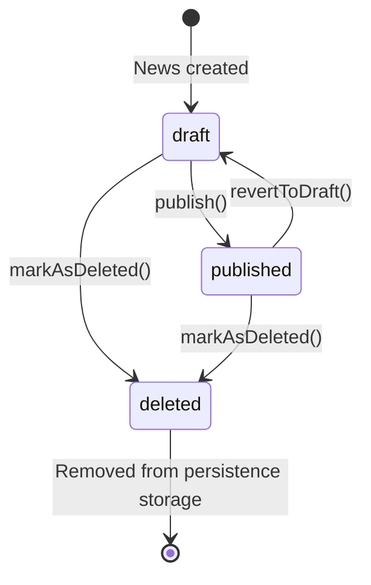

# News entity

Simple content aggregate for in-app news feed. Admin creates news entries
(title + markdown text) that are displayed inside the application.

## Methods

| Method              | Return Type       | Description                          | Throws                     |
|---------------------|-------------------|--------------------------------------|----------------------------|
| `getId()`           | `Uuid`            | Returns news id                      |                            |
| `getCreatedAt()`    | `CarbonImmutable` | Returns creation timestamp           |                            |
| `getUpdatedAt()`    | `CarbonImmutable` | Returns last update timestamp        |                            |
| `getTitle()`        | `string`          | Returns news title                   |                            |
| `changeTitle()`     | `void`            | Changes news title                   | `InvalidArgumentException` |
| `getText()`         | `string`          | Returns news body (markdown)         |                            |
| `changeText()`      | `void`            | Changes news body                    | `InvalidArgumentException` |
| `getStatus()`       | `NewsStatus`      | Returns news status                  |                            |
| `publish()`         | `void`            | Changes status draft → published     | `LogicException`           |
| `revertToDraft()`   | `void`            | Changes status published → draft     | `LogicException`           |
| `markAsDeleted()`   | `void`            | Soft-deletes news (status → deleted) | `LogicException`           |

## News state diagram

## Repository methods

- `save(News $news): void`
    - use case Create
    - use case Update
    - use case Publish
    - use case RevertToDraft
    - use case Delete
- `getById(Uuid $uuid): News`
    - excludes deleted news
    - throws `NewsNotFoundException` if not found
    - use case Update
    - use case Publish
    - use case RevertToDraft
    - use case Delete
- `findByTitle(string $title): News[]`
    - exact title match
- `findPublished(int $page = 1, int $limit = 20): PaginationInterface<News>`
    - KNP-paginated feed, sorted by `createdAt DESC`
    - returns only `published` news
- `findDrafts(int $page = 1, int $limit = 20): PaginationInterface<News>`
    - KNP-paginated list, sorted by `createdAt DESC`
    - returns only `draft` news

## Events

- `NewsCreatedEvent` – Event triggered when a new news item was created.
- `NewsPublishedEvent` – Event triggered when news was published to the feed.
- `NewsRevertedToDraftEvent` – Event triggered when published news was reverted to draft.
- `NewsDeletedEvent` – Event triggered when news was soft-deleted.
- `NewsTitleChangedEvent` – Event triggered when news title was changed.
- `NewsTextChangedEvent` – Event triggered when news body text was changed.
